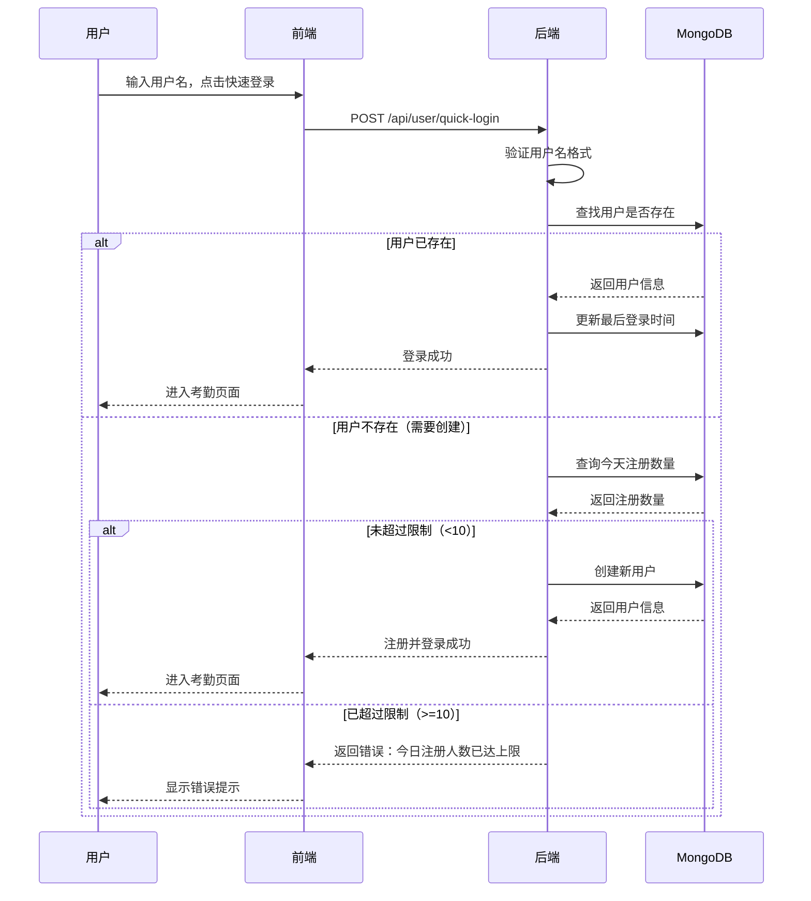

# 注册限制功能说明

## 📋 功能概述

为了防止恶意注册和保护系统资源，系统实现了**每天最多注册10个新用户**的限制。

## 🎯 限制规则

- **每日限额**：每天最多允许注册 10 个新用户
- **计算周期**：从当天 00:00:00 到 23:59:59
- **限制范围**：
  - ✅ 用户注册接口（`/api/user/register`）
  - ✅ 快速登录接口（`/api/user/quick-login`，仅限新用户创建）
  - ❌ 已有用户登录不受限制

## 🔧 技术实现

### 后端实现

**文件位置**：`backend/src/services/userService.js`

**核心方法**：
```javascript
static async checkDailyRegistrationLimit() {
  // 获取今天的开始时间（00:00:00）
  const today = new Date();
  today.setHours(0, 0, 0, 0);

  // 获取明天的开始时间（00:00:00）
  const tomorrow = new Date(today);
  tomorrow.setDate(tomorrow.getDate() + 1);

  // 查询今天注册的用户数量
  const todayRegistrationCount = await User.countDocuments({
    createdAt: {
      $gte: today,
      $lt: tomorrow
    }
  });

  // 每天最多注册10个用户
  const dailyLimit = 10;

  return {
    isExceeded: todayRegistrationCount >= dailyLimit,
    currentCount: todayRegistrationCount,
    limit: dailyLimit,
    remaining: Math.max(0, dailyLimit - todayRegistrationCount)
  };
}
```

**应用位置**：
1. `register()` 方法 - 用户注册时检查
2. `quickLogin()` 方法 - 快速登录创建新用户时检查

### 前端提示

**文件位置**：`frontend/src/components/Login.jsx`

在登录页面的提示信息中添加了注册限制说明：
```
⚠️ 每天最多注册10个新用户，超过限制请明天再试
```

## 📊 工作流程



## 🧪 测试场景

### 场景1：正常注册（未达限制）

**操作**：
1. 输入新用户名 `user001`
2. 点击"快速登录"

**预期结果**：
- ✅ 注册成功
- ✅ 自动登录
- ✅ 进入考勤页面

### 场景2：达到限制

**前提条件**：当天已注册 10 个用户

**操作**：
1. 输入新用户名 `user011`
2. 点击"快速登录"

**预期结果**：
- ❌ 注册失败
- 显示错误提示："今日注册人数已达上限（10人），请明天再试或使用已有账号登录"

### 场景3：已有用户登录（不受限制）

**前提条件**：当天已注册 10 个用户

**操作**：
1. 输入已存在的用户名 `demo`
2. 点击"快速登录"

**预期结果**：
- ✅ 登录成功（不受注册限制影响）
- ✅ 进入考勤页面

### 场景4：跨天重置

**前提条件**：昨天已注册 10 个用户

**操作**：
1. 等待到第二天 00:00:00
2. 输入新用户名 `newuser`
3. 点击"快速登录"

**预期结果**：
- ✅ 注册成功（计数器已重置）
- ✅ 自动登录
- ✅ 进入考勤页面

## 📈 数据统计

### 查询今日注册数量

可以通过以下 MongoDB 查询来查看今日注册数量：

```javascript
// 获取今天的开始时间
const today = new Date();
today.setHours(0, 0, 0, 0);

// 获取明天的开始时间
const tomorrow = new Date(today);
tomorrow.setDate(tomorrow.getDate() + 1);

// 查询今天注册的用户
db.users.find({
  createdAt: {
    $gte: today,
    $lt: tomorrow
  }
}).count();
```

### 查询今日注册的用户列表

```javascript
db.users.find({
  createdAt: {
    $gte: new Date(new Date().setHours(0, 0, 0, 0)),
    $lt: new Date(new Date().setHours(0, 0, 0, 0) + 86400000)
  }
}).sort({ createdAt: -1 });
```

## ⚙️ 配置说明

### 修改每日限额

如果需要修改每日注册限额，请编辑以下文件：

**文件**：`backend/src/services/userService.js`

**位置**：`checkDailyRegistrationLimit()` 方法中

```javascript
// 修改这个值来调整每日限额
const dailyLimit = 10;  // 改为你想要的数字
```

### 建议的限额设置

| 场景 | 建议限额 | 说明 |
|------|---------|------|
| 小型团队 | 5-10 | 适合小型公司或部门 |
| 中型企业 | 20-50 | 适合中型企业 |
| 大型企业 | 100+ | 适合大型企业或开放注册 |
| 测试环境 | 无限制 | 可以注释掉限制检查 |

## 🔒 安全性考虑

1. **防止恶意注册**：限制每日注册数量，防止批量注册攻击
2. **资源保护**：避免数据库被大量无效用户占用
3. **服务质量**：确保系统稳定性和响应速度
4. **灵活性**：已有用户登录不受限制，不影响正常使用

## 📝 错误信息

### 注册限制错误

**错误信息**：
```
今日注册人数已达上限（10人），请明天再试
```

**解决方案**：
1. 等待到第二天再注册
2. 使用已有账号登录
3. 联系管理员增加限额

### 快速登录限制错误

**错误信息**：
```
今日注册人数已达上限（10人），请明天再试或使用已有账号登录
```

**解决方案**：
1. 使用已有账号登录（如 demo）
2. 等待到第二天再创建新账号
3. 联系管理员

## 🎯 最佳实践

1. **提前规划**：在系统上线前评估预期用户数量，设置合理的限额
2. **监控统计**：定期查看每日注册数量，及时调整限额
3. **用户提示**：在登录页面明确告知用户注册限制
4. **灵活调整**：根据实际使用情况动态调整限额
5. **日志记录**：记录达到限制的情况，便于分析和优化

## 🔄 未来优化方向

1. **动态限额**：根据系统负载自动调整限额
2. **白名单机制**：特定用户或IP不受限制
3. **分级限制**：不同时间段设置不同的限额
4. **通知机制**：达到限额时通知管理员
5. **统计报表**：提供注册数量的可视化统计

## 📞 技术支持

如有问题或需要调整限额，请联系系统管理员。
